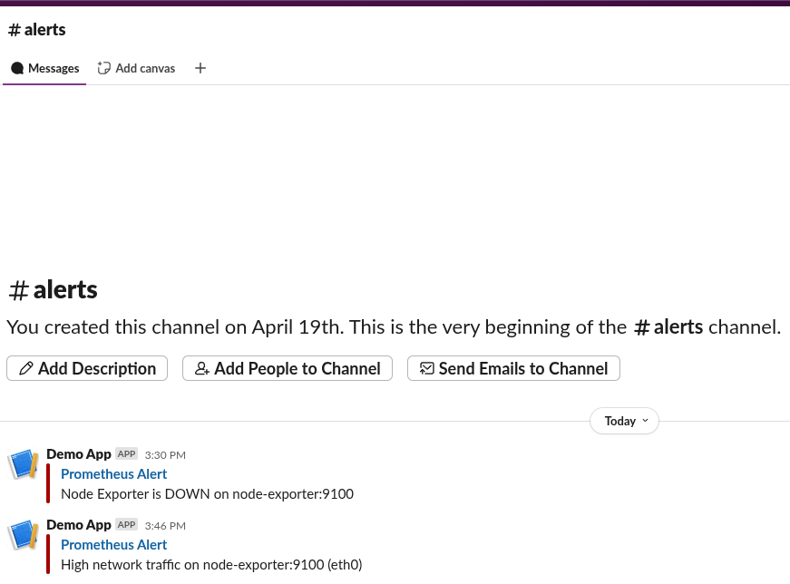

# 🔍 Monitoring & Alerting with Prometheus + Grafana

This project demonstrates a complete monitoring and alerting stack using Prometheus, Grafana, and Alertmanager. It monitors both system metrics and custom application metrics.

## 📦 Stack
- Docker + Docker Compose
- Prometheus + Node Exporter
- Grafana (preconfigured dashboard)
- Alertmanager Slack: Incoming Webhooks, alerts channel

## 🖥️ Monitored Metrics
- CPU / Memory / Disk
- HTTP metrics from a sample FastAPI application
- Uptime and error rate

## 📊 Screenshots





## 🚀 Getting Started
```bash
git clone https://github.com/your_repo.git
cd devops-monitoring

docker-compose build
docker-compose up -d